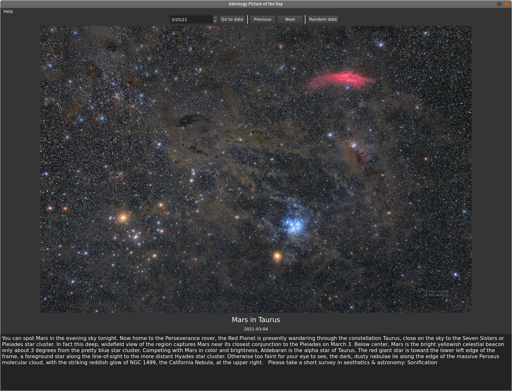
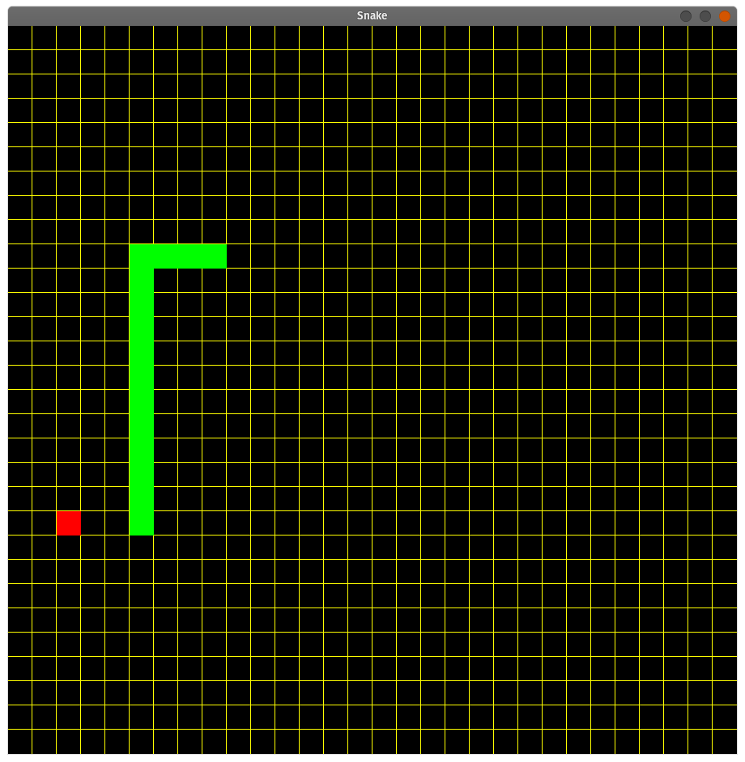
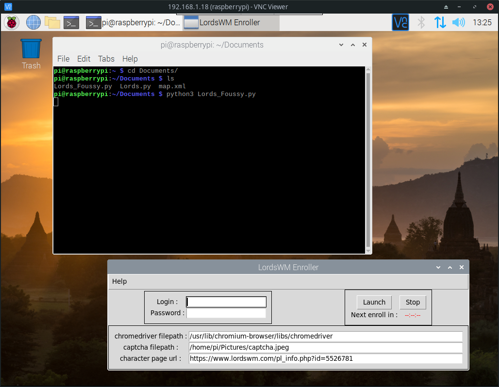
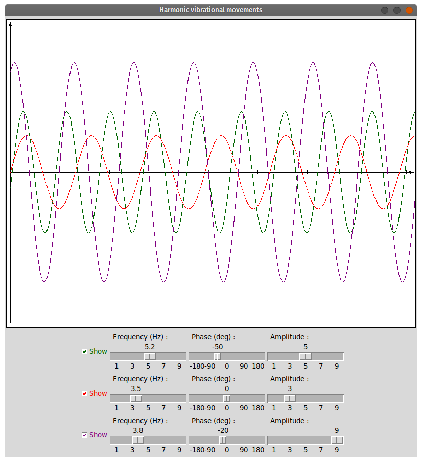

# project 1 : pyapod
## Python3 | PyQt5

This software is a cross platform front-end of the [Astronomy Picture Of the Day website](https://apod.nasa.gov/apod/astropix.html) posting Space related photos & videos everyday since June 1995. It is designed with python3 and PyQt5 and it uses the API developped by NASA.

Main features :
* Loading and rezising dynamically the images from the API. 
* Opens up today’s picture
* Possibility to change the date backward/forward, select a specific or a random one.
* Title, date, description and copyrights displayed of the bottom textbox.
* Dark theme for better aesthetic and consistency with Space.

Features in developement :
* Favorites menu
* Cache manager to enhance performance when loading and resizing images

I developed this project mainly because I like apod a lot and I regularly kill some time browsing pictures and reading about Space on it. It was a good introduction to start learning about APIs.

---

# project 2 : Finite element analysis viewer
## Python3 | SQL | PyQt5 | pptk | multiprocessing | matplotlib

This is a productivity tool I developed working as a simulation engineer. In simple words, its purpose is to recover data extracted from CATIA V5's calculations, and display them in the most efficient and practical way for an engineer to analyze the results and utilize it as a decision maker.

At that time, I was doing finite element analysis (FEA) using shell elements (2D element) for carbon composites structures. This type of structures can be described as a multi-layered oriented stacks of carbon fibers. Doing the post-processing for big model results can be such a time-consuming task in CATIA V5, because some structures I was designing could contain many layers (up to 50) and I had to look in each one of them for the critical nodes (my biggest model contained 1 million nodes). Moreover, the software offered poor performances for this specific task.

Eventually, I came up with this workflow :
* After I was satisfied with a design, I was running a python script to manage the inputs of my model (.xml) and give it to CATIA
* I would then launch a macro in CATIA that launches the computation, generates the results and exports all of it in raw text files
* From this text files, I would use the software to recover x/y/z coord for each node of the mesh, the stress tensor, deformations, specific composites failure criterion (Hashin, Tsai-Wu, Puck...)
* The software then sorts & reorganizes the results, removes the duplicates and the unwanted nodes. 
* It stores them in a .db file which can then be loaded within the program to generate colorized cloud points in a 3D embedded window (_pptk_).

There are many features to this program, like the possibility to change the color threshold, to sort the point in tables which directly interact with the 3D window, to quickly and smoothly switch from one carbon layer to the other, and many others...

This software has been very useful for me and my team. 

---

# project 3 : Snake
## C++ | SFML

Well... It's a Snake game.

---

# project 4 : Game bot
## Python3 | tkinter | selenium | pytesseract | anticaptcha

Context : When I was ~13 years old, I started playing an online strategy turn-by-turn game called Lordswm.com. In this game, you can earn virtual money by going into factories and “work” for a certain wage. There is an economic system within the game and since I dug a bit into it, I found a way to entirely automate the process of earning money.

I was running this programm on my raspberry pi. What it does is :
* Every hour, it opens up a web browser using Selenium and logs me into the website.
* Then it performs some specific game tasks : find the location of my character, find factories with free slots sorted by descending wage, download a captcha and solve it (using OCR service). 

I also added several improvements like a market surveillance feature to check if some goods were sold under a threshold value I would fix. It would buy them and automatically put them back in the market for a higher bid.

For further development, I was keeping track of every captcha I was downloading to train my own AI. I started learning about neuronal network and went with tensor flow but I eventually got my account closed for exploiting the game. Anyhow I had a lot of fun doing this project, because I had so few knowledge of everything. I spent a lot of time searching for documentations, browsing and tinkering a way to get things done. This is definetely not a big OOP project and the GUI is ugly, but this project is among my first ones and I liked every bit of it. This is why it is in the list.

---

# project 5 : Harmonic movements
## Python | tkinter

I coded this program as part of my training as I was learning OOP. It can display parameterized sinusoids thanks to *'scale'* widgets instantly into the *´canvas´*.

---

# project 6 : Fluid dynamics
## C++ | Qt | SFML

Work in progress...
